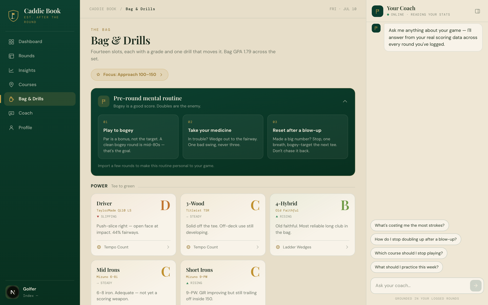

# Caddie Book

**The after-the-round coach that sits on top of [18Birdies](https://18birdies.com).**

You already score your rounds in 18Birdies (free). Caddie Book imports that data and answers
the one question 18Birdies/Arccos charge a premium for: *what's costing me strokes, and what do
I do about it?*

It does **not** try to replace 18Birdies. No on-course scoring, no GPS, no double entry. You
play, export your data once, drop the file in, and get premium-grade post-round analysis on the
rounds you already have.

Built with Next.js 16 (App Router) + React 19 + Tailwind 4, with AI via [OpenRouter](https://openrouter.ai).



---

## What you get

- **Insights**: blow-up-hole map, gap-to-goal, scoring trend, front/back split, consistency.
- **Strokes Gained: Total**: honest, course-difficulty-adjusted (no shot-tracking needed):
  where you leak strokes vs. the difficulty of each course.
- **Mental game / tilt score**: after a blow-up hole, how often does the next hole stay clean?
  Plus a pre-round routine and a per-round bounce-back read.
- **Coach**: an AI coach grounded in your real numbers (avg, double-bogey rate, tilt, per-course
  patterns), with a damage-control plan that tracks whether you're improving.
- **Ask Coach anything**: chat about your own game ("which course is hardest", "why do I blow up").
- **WHS handicap engine**, per-hole scorecards, course ranking, and a course map.

Every insight is built on **scoring data only** (per-hole scores, totals, distribution, handicap),
the signals that are actually trustworthy. It never fabricates precision from unreliable stats.

---

## Setup

New to this? **[SETUP.md](SETUP.md)** is a step-by-step guide to getting an OpenRouter key and
(optionally) a Turso database. It also has a **"do it with Claude Code"** mode: open the folder
in [Claude Code](https://claude.com/claude-code) and it'll create the database, write your config,
and start the app for you.

### Quick local start (zero cloud setup)

```bash
git clone https://github.com/mohit-nontechnical/caddie-book-public.git
cd caddie-book-public
npm install
cp .env.example .env.local        # then paste your OpenRouter key into it
npm run dev
```

Open the URL printed in the terminal. Rounds are stored in a local `caddie.db` SQLite file
(created automatically, gitignored), no database account needed.

> Without an OpenRouter key the UI still works, use the demo buttons to see the flow.
> The AI features (coach, scorecard OCR) need a free key from https://openrouter.ai/keys.

---

## Deploy your own copy (recommended for sharing)

Caddie Book is **single-user by design**: one deployment holds one golfer's data. To share it
with friends, each person runs **their own copy** so everyone's rounds stay private and separate.
Don't have your friends type into your live URL; they'd share your database.

One-click deploy (you'll be prompted for the env vars below):

[](https://vercel.com/new/clone?repository-url=https%3A%2F%2Fgithub.com%2Fmohit-nontechnical%2Fcaddie-book-public&env=OPENROUTER_API_KEY,TURSO_DATABASE_URL,TURSO_AUTH_TOKEN,APP_PASSCODE&envDescription=OpenRouter%20key%20for%20AI%2C%20a%20free%20Turso%20DB%20for%20cloud%20storage%2C%20and%20a%20passcode%20to%20lock%20your%20app&envLink=https%3A%2F%2Fgithub.com%2Fmohit-nontechnical%2Fcaddie-book-public%23environment-variables)

On Vercel you **must** use Turso (the filesystem is read-only, so the local-file fallback won't
persist). A free Turso DB takes two minutes to create. Local dev does not need Turso.

### Environment variables

| Variable | Required? | What it is |
|----------|-----------|------------|
| `OPENROUTER_API_KEY` | for AI features | Free key from https://openrouter.ai/keys |
| `TURSO_DATABASE_URL` | for cloud deploy | Free DB from https://turso.tech (`libsql://…`) |
| `TURSO_AUTH_TOKEN` | for cloud deploy | Auth token from the same Turso DB |
| `APP_PASSCODE` | optional | Locks the app behind a passcode. Unset = no gate (fine for local). |

See [`.env.example`](.env.example) for the template.

---

## Get your data in (the front door)

18Birdies has no CSV/API export, but its **Download Your Account Data**
(https://18birdies.com/download-account-data/) emails you a JSON archive of every round.

1. Request the download from 18Birdies and grab the JSON file.
2. Open Caddie Book → **Upload** tab → the **18Birdies** tile → pick the file.
3. It bulk-imports every round. Re-importing later is **idempotent**: it only adds what's new,
   so this is your ongoing re-sync, not a one-time migration.

Play more rounds in 18Birdies → re-export → drop it in. That's the whole loop.

---

## How it's built

```
app/
  page.tsx                  # mounts the app
  layout.tsx                # fonts + PWA metadata
  components/               # all UI (responsive mobile web app)
  api/
    import-18birdies/       # 18Birdies JSON archive → rounds (idempotent)
    insights/               # scoring-pattern analysis + season tilt
    strokes-gained/         # course-adjusted Strokes Gained: Total
    debrief/                # per-round debrief after an import
    preround/               # pre-round mental routine
    coach/                  # round history → patterns, grades, tracked plan
    coach-chat/             # conversational coach grounded in your numbers
    handicap/ rounds/ courses/ stats/ grades/
    parse-round/            # (bonus) scorecard photo → holes via vision OCR
    analyze-swing/          # (bonus) swing frames → coaching note
lib/
  import-18birdies.ts       # 18Birdies archive mapper
  caddie-store.ts           # round persistence via libSQL (local file or Turso cloud)
  handicap.ts               # WHS handicap engine
  course-ratings.ts         # course rating/slope data
  openrouter.ts             # OpenRouter chat client + JSON/vision helpers
```

### Models (via OpenRouter)

| Task | Model | Why |
|------|-------|-----|
| Vision (scorecard OCR, swing) | `google/gemini-2.5-flash` | robust, cheap vision |
| Coach / patterns / chat | `anthropic/claude-sonnet-4.5` | multi-round synthesis |

---

## License

MIT. See [LICENSE](LICENSE). Built for fun. Not affiliated with 18Birdies.
